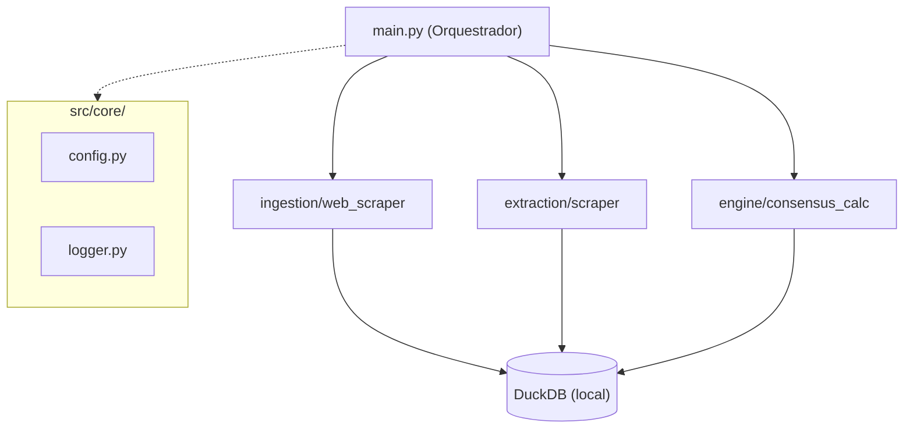

# QuantConsensus

Sistema para consolidar carteiras recomendadas de acoes do mercado brasileiro.
O pipeline coleta as recomendacoes mensais publicadas por diversas corretoras,
calcula o consenso por votacao e gera um ranking dos ativos mais indicados,
desempatando pelo volume medio de negociacao.

---

## Sumario

- [Visao Geral](#visao-geral)
- [Arquitetura](#arquitetura)
- [Requisitos](#requisitos)
- [Instalacao](#instalacao)
- [Uso](#uso)
- [Banco de Dados](#banco-de-dados)
- [Testes](#testes)
- [Qualidade de Codigo](#qualidade-de-codigo)
- [Estrutura do Projeto](#estrutura-do-projeto)
- [Configuracao](#configuracao)
- [Licenca](#licenca)

---

## Visao Geral

O QuantConsensus executa um pipeline de dados com tres etapas:

1. **Ingestao** -- Raspagem (web scraping) da pagina Carteira Valor, coletando
   as recomendacoes de cada corretora participante.
2. **Extracao** -- Parse do HTML para estruturacao dos dados brutos em formato
   tabular (corretora, tickers, mes de referencia).
3. **Engine** -- Calculo analitico de consenso via DuckDB, ranqueando os ativos
   por numero de votos e desempatando pelo volume medio de negociacao.

O resultado final e exibido diretamente no terminal como um ranking Top 10.

---

## Arquitetura



- **`src/core/`** -- Configuracoes centralizadas (`config.py`) e logging
  estruturado com Loguru (`logger.py`).
- **`src/ingestion/`** -- Modulo de ingestao generica de texto web via
  Trafilatura.
- **`src/extraction/`** -- Scraper especializado para o HTML da pagina
  Carteira Valor (BeautifulSoup).
- **`src/engine/`** -- Motor analitico SQL sobre DuckDB com views
  pre-calculadas, ranking e desempate por volume.

---

## Requisitos

- Python 3.10+  (projeto desenvolvido e testado com 3.12)
- [uv](https://docs.astral.sh/uv/) como gerenciador de dependencias

---

## Instalacao

```bash
# Clone o repositorio
git clone <url-do-repositorio>
cd quant_consensus

# Instale as dependencias com uv
uv sync
```

Para incluir as dependencias de desenvolvimento (testes, linter, type-checker):

```bash
uv sync --group dev
```

---

## Uso

### Carteira do mes corrente

```bash
uv run python main.py
```

O pipeline busca as recomendacoes do mes atual, persiste no DuckDB e exibe o
ranking de consenso no terminal.

### Historico (completo ou a partir de um periodo)

Voce pode baixar todo o historico desde janeiro de 2022 ou focar em um periodo especifico passando um argumento.

```bash
# Baixa todo o historico desde Jan/2022
uv run python main.py --historico

# Baixa a partir de janeiro de um ano especifico (ex: 2024)
uv run python main.py --historico 2024

# Baixa a partir de um mes e ano especificos (ex: Marco de 2024)
uv run python main.py --historico 2024-03
```

Baixa as carteiras mensais do periodo especificado, armazenando cada mes
no banco de dados. Meses ja presentes no cache sao ignorados automaticamente.

### Exemplo de saida

```
=================================================================
         CARTEIRA CONSENSO DO MES (2026-08)
=================================================================

RANK   | TICKER   | VOTOS    | VOLUME MEDIO
-----------------------------------------------------------------
#1     | PETR4    | 8        | (UNANIMIDADE) R$ 1.500.000.000,00
#2     | VALE3    | 7        |  R$ 1.200.000.000,00
#3     | ITUB4    | 6        |  R$ 900.000.000,00
...
=================================================================
```

---

## Banco de Dados

O projeto utiliza **DuckDB** como data warehouse local embarcado. O arquivo e
gerado automaticamente na pasta `data/` do projeto:

```
data/quant_consensus_prod.duckdb
```

### Tabelas

| Tabela                | Descricao                                              |
|-----------------------|--------------------------------------------------------|
| `raw_recomendacoes`   | Recomendacoes brutas (corretora, ticker, mes_ref)      |
| `dados_mercado`       | Volume medio diario por ticker (dados simulados)       |

### Views analiticas

| View                        | Descricao                                                       |
|-----------------------------|-----------------------------------------------------------------|
| `vw_carteira_consolidada`   | Ranking Top 10 por mes com desempate por volume                 |
| `vw_corretoras_por_mes`     | Corretoras rastreadas em cada mes de referencia                 |
| `vw_dados_corretoras`       | Extrato linear de cada recomendacao por corretora               |
| `vw_alteracoes_carteira`    | Movimentacao mensal (Entrada, Saida, Manutencao) por corretora  |

Para mais detalhes sobre como acessar e consultar o banco, veja o guia
completo em [`docs/GUIA_BANCO_DE_DADOS.md`](docs/GUIA_BANCO_DE_DADOS.md).

---

## Testes

O projeto utiliza **pytest** como framework de testes com **pytest-mock** para
mocking e **pytest-cov** para cobertura.

```bash
# Executar todos os testes
uv run pytest

# Executar com cobertura
uv run pytest --cov=src --cov-report=term-missing

# Executar testes de um modulo especifico
uv run pytest tests/engine/
uv run pytest tests/extraction/
uv run pytest tests/ingestion/
```

### Estrutura de testes

```
tests/
  engine/
    test_consensus_calc.py    # Testes do motor de consenso e persistencia
  extraction/
    test_llm_parser.py        # Testes do parser de extracao
  ingestion/
    test_discovery.py         # Testes de descoberta de fontes
    test_web_scraper.py       # Testes do scraper web
```

---

## Qualidade de Codigo

### Linting e formatacao (Ruff)

```bash
# Verificar problemas
uv run ruff check src/ tests/

# Corrigir automaticamente
uv run ruff check --fix src/ tests/

# Formatar codigo
uv run ruff format src/ tests/
```

Regras ativas: `E`, `F`, `I`, `W`, `D` (Google-style docstrings), `BLE`,
`FURB`, `DTZ`. Linha maxima de 88 caracteres.

### Type-checking (mypy)

```bash
uv run mypy src/
```

Configurado em modo estrito (`strict = true`).

---

## Estrutura do Projeto

```
quant_consensus/
|-- main.py                    # Ponto de entrada principal
|-- pyproject.toml             # Metadados, dependencias e configuracao de ferramentas
|-- pytest.ini                 # Configuracao do pytest
|-- uv.lock                   # Lock de dependencias (uv)
|-- .python-version            # Versao do Python (3.12)
|
|-- src/
|   |-- __init__.py
|   |-- main.py                # Orquestrador do pipeline (CLI)
|   |-- core/
|   |   |-- config.py          # Configuracoes centralizadas (dataclass)
|   |   |-- logger.py          # Setup do Loguru (console + arquivo rotacionado)
|   |-- engine/
|   |   |-- consensus_calc.py  # Motor analitico DuckDB + PyArrow
|   |-- extraction/
|   |   |-- scraper.py         # Scraper HTML da Carteira Valor
|   |-- ingestion/
|       |-- web_scraper.py     # Extracao generica de texto web (Trafilatura)
|
|-- tests/
|   |-- engine/
|   |   |-- test_consensus_calc.py
|   |-- extraction/
|   |   |-- test_llm_parser.py
|   |-- ingestion/
|       |-- test_discovery.py
|       |-- test_web_scraper.py
|
|-- docs/
|   |-- GUIA_BANCO_DE_DADOS.md  # Guia de uso do DuckDB
|
|-- logs/                       # Logs rotacionados automaticamente
```

---

## Configuracao

As configuracoes sao gerenciadas pela dataclass `Settings` em
[`src/core/config.py`](src/core/config.py) e podem ser sobrescritas por
variaveis de ambiente:

| Variavel               | Padrao                                                        | Descricao                                  |
|------------------------|---------------------------------------------------------------|--------------------------------------------|
| `CARTEIRA_VALOR_URL`   | `https://infograficos.valor.globo.com/carteira-valor/`        | URL base da pagina Carteira Valor          |
| `DB_PATH`              | `data/quant_consensus_prod.duckdb`                            | Caminho do arquivo DuckDB                  |
| `ANO_INICIO_HISTORICO` | `2022`                                                        | Ano base inicial para raspagem de historico|
| `REQUEST_TIMEOUT`      | `15`                                                          | Timeout (em segundos) das requisicoes HTTP |

---

## Dependencias principais

| Pacote           | Finalidade                                        |
|------------------|---------------------------------------------------|
| `beautifulsoup4` | Parse de HTML para extracao de dados estruturados  |
| `duckdb`         | Data warehouse analitico embarcado (OLAP)          |
| `pandas`         | Manipulacao de dados tabulares                     |
| `pyarrow`        | Formato colunar de alta performance em memoria     |
| `loguru`         | Logging estruturado com rotacao e compressao       |
| `trafilatura`    | Extracao de texto principal de paginas web          |
| `ddgs`           | Busca web via DuckDuckGo                           |
| `requests`       | Requisicoes HTTP                                   |

---

## Licenca

Este projeto nao possui uma licenca definida. Todos os direitos reservados.
